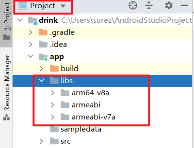
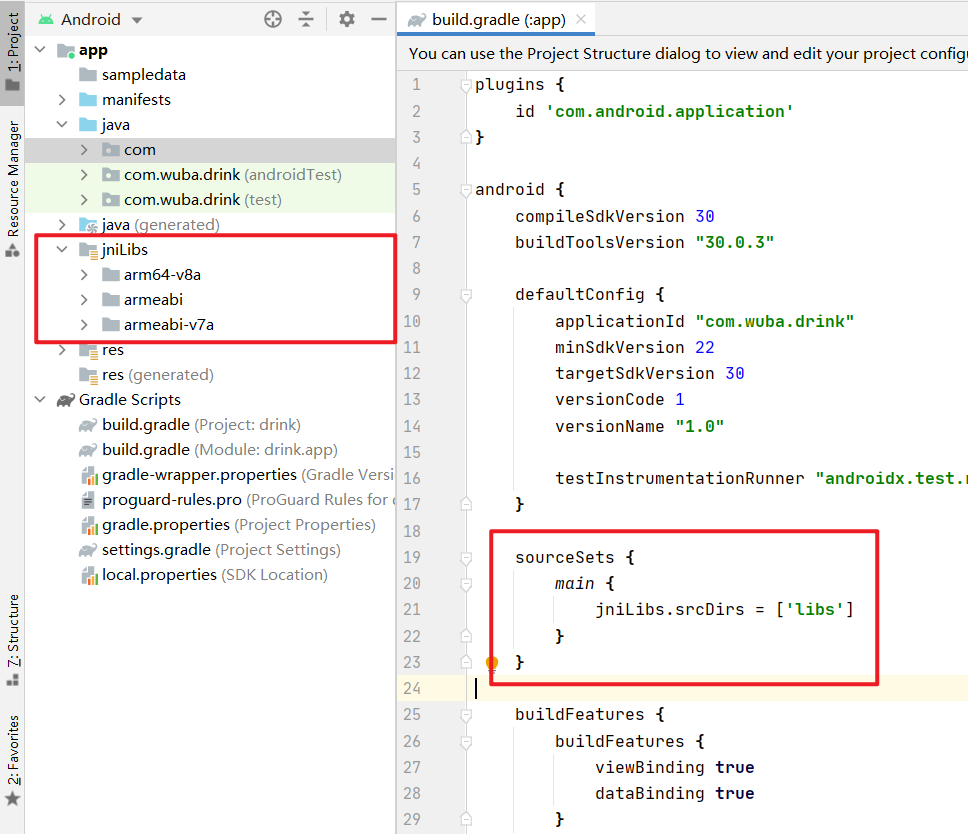
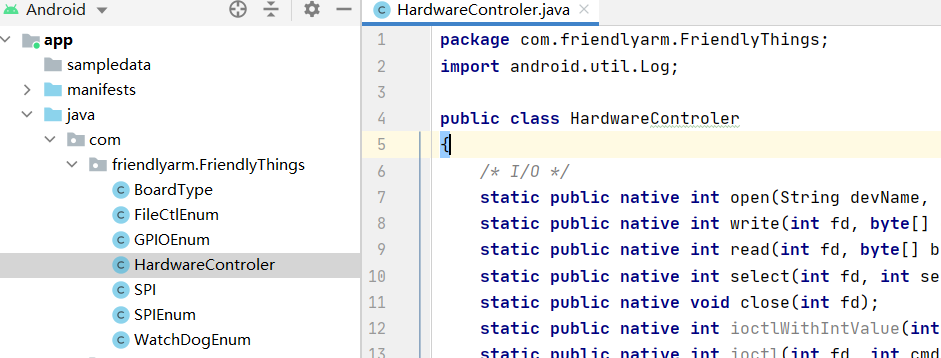
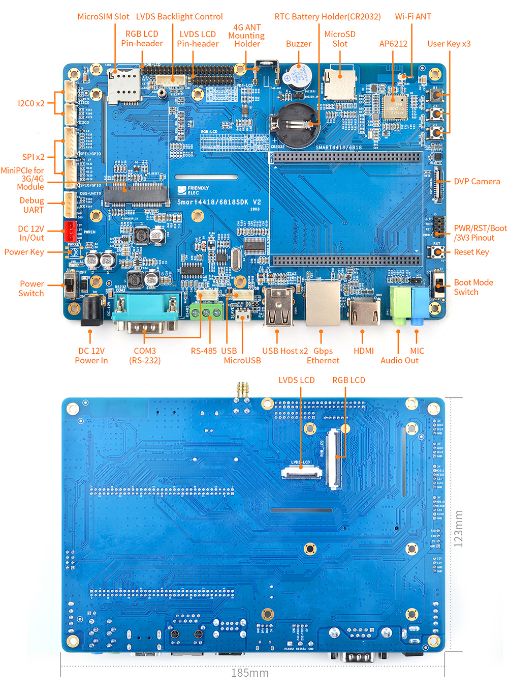
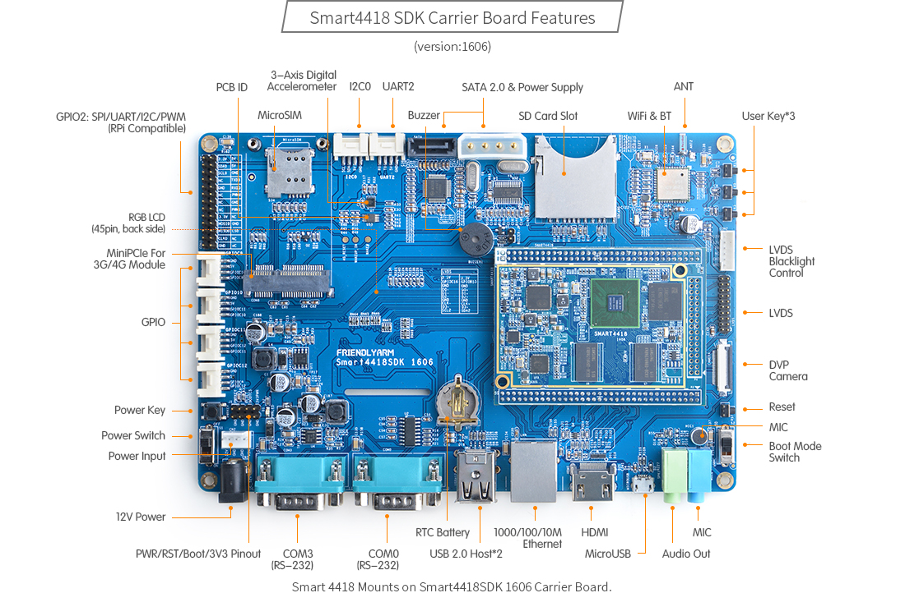

# Smart4418 套件开发注意事项

- 相关文件提供在压缩包附件中

- 前提：区分套件的**底板版本**，这是本文的主要内容。旧底板（`Smart4418 SDK`）与新底板（`Smart4418/6818 SDK`）的资源不同、相同资源的接口也可能不同，又因为发布时间不同，它们预安装系统版本也有不同，新板子为`Android 7.1`，旧板子为`Andorid 5.1`。

## 参考文档

- [Smart4418](http://wiki.friendlyarm.com/wiki/index.php/Smart4418/zh)：主要是`Smart4418`核心板的相关说明
- [Smart4418/6818SDK V2](http://wiki.friendlyarm.com/wiki/index.php/Smart4418/6818SDK_V2/zh)：新开发底板的说明，比如硬件资源，硬件部分最常使用的文档。
- [Smart4418SDK](http://wiki.friendlyarm.com/wiki/index.php/Smart4418SDK)：旧开发底板的说明。
- [FriendlyThings](http://wiki.friendlyarm.com/wiki/index.php/FriendlyThings/zh)：友善自己的一套安卓硬件开发`SDK`，我们一般使用它来访问硬件资源
- [FriendlyThings APIs](https://wiki.friendlyarm.com/wiki/index.php/FriendlyThings_APIs/zh)：`FriendlyThings`的`API`文档，软件开发最常使用的文档。
- [friendlyarm/friendlythings-sdk](https://github.com/friendlyarm/friendlythings-sdk)：`FriendlyThings`的SDK，复制进入项目使用即可。
- [friendlyarm/friendlythings-examples ](https://github.com/friendlyarm/friendlythings-examples)：`FriendlyThings`的例程，可以参考（但是代码比较旧且繁杂，调用 SDK的关键代码也难以找到）。
- [Smart4418-6818SDK_V2-1903.pdf](http://wiki.friendlyarm.com/wiki/images/1/18/SCHEMATIC_Smart4418-6818SDK_V2-1903.pdf)：新板子的电路原理图
- [Smart4418-1711-Schematic.pdf](http://wiki.friendlyarm.com/wiki/images/c/c2/Smart4418-1711-Schematic.pdf)：旧板子的电路原理图

### 其他
- [shoorday/smart4418-dev-tips](https://github.com/shoorday/smart4418-dev-tips)：本文地址
- [shoorday/smart4418-waste-sorting](https://github.com/shoorday/smart4418-waste-sorting)：参考项目，可参考串口通信实现

## 使用SDK

1. 下载SDK（附件中有）

   其目录结构如下

   ```shell
   friendlythings-sdk/
   ├── libs # 动态链接库
   │   ├── armeabi-v7a
   │   │   └── libfriendlyarm-things.so
   │   ├── arm64-v8a
   │   │   └── libfriendlyarm-things.so
   │   └── armeabi
   │       └── libfriendlyarm-things.so
   ├── java
   │   └── FriendlyThings # 函数库，开发者调用
   │       │   ├── BoardType.java
   │       │   ├── FileCtlEnum.java
   │       │   ├── GPIOEnum.java
   │       │   ├── HardwareControler.java
   │       │   ├── SPIEnum.java
   │       │   ├── SPI.java
   │       │   ├── WatchDogEnum.java
   ```

2. 添加动态链接库

   1. 复制`libs`下内容到项目目录`app/libs`下，没有的话手动创建，可将目录书切换到`Project`视图

      

   2. 将动态链接库添加到编译源码

      在app的gradle中添加`sourceSets`：

      ```groovy
      plugins {
          ...
      }
      
      android {
          ...
          sourceSets {
              main {
                  jniLibs.srcDirs = ['libs']
              }
          }
          ...
      }
      ```

      

3. 添加函数库

   将函数库复制到你的项目中，放在`com.friendlyarm.FriendlyThings`中。

   

4. 然后参考SDK [API文档](https://wiki.friendlyarm.com/wiki/index.php/FriendlyThings_APIs/zh)和[例程](https://github.com/friendlyarm/friendlythings-examples)，调用函数库，访问硬件资源，编写你的代码即可。

## 签名 App

访问硬件资源不可避免的需要系统权限，这时我们一般将`App`的共享用户设为系统用户。

1. 设置`sharedUserId`
   
    修改`AndroidManifest.xml`文件，为`manifest`标签添加`android:sharedUserId="android.uid.system"`
    
    ```xml
    <?xml version="1.0" encoding="utf-8"?>
    <manifest xmlns:android="http://schemas.android.com/apk/res/android"
        package="com.shoor.drink"
        android:sharedUserId="android.uid.system">
        <application>
            ...
        </application>
    </manifest>
    ```
    
2. 签名`App`
    因为我们使用了系统用户，`App`需要进行系统用户签名（[FriendlyThings](http://wiki.friendlyarm.com/wiki/index.php/FriendlyThings/zh) 中提供了在Android源码中编译App的方式，更为繁琐）。

    签名使用的是`Android`的签名工具`signapk.jar`，其需要的证书与公钥与具体系统有关，应到其源码去找，新板子`Android 7`的证书是原生`Android`的，旧板子`Android 5`的证书则是厂商友善自己的。

    签名命令如下：

    ```shell
    java -jar signapk.jar platform.x509.pem platform.pk8 plain.apk signed-app.apk
    
    # 使用 java 运行签名工具 signapk
    # signapk 的参数依次是pem文件、pk8文件，未签名app路径，签名后的app输出路径
    ```

    注意：

    - `java`可能会要求与编译 App 的 java 版本相同，这时可以直接用Andriod Studio自带的java进行编译。

      比如，笔者Android Studio自带的`java.exe`的路径是`C:\Users\surez\AppData\Local\JetBrains\Toolbox\apps\AndroidStudio\ch-0\201.7199119\jre\bin\java.exe`。

    其他：

    - 注意文件路径；
    - Android Studio打包（右上绿色锤子，Make Project）后的 App 在项目根目录下`app\build\outputs\apk\debug\app-debug.apk`。
    - 证书相关文件在系统源码的`security`目录下，比如原生Andorid的：[security (googlesource.com)](https://android.googlesource.com/platform/build/+/donut-release/target/product/security)

3. 安装`App`

    安装`App`比较简单的方式是使用`adb`工具。

    ```shell
    adb -d install -r signed-app.apk
    # -d 表示选则USB连接设备，避免与虚拟机冲突
    # -r 表示若已经安装，则重新安装（replace）
    # 最后一个参数是 apk 路径
    
    # Tip: 一次命令更便捷
    java -jar signapk.jar platform.x509.pem platform.pk8 plain.apk signed-app.apk && adb -d install -r signed-app.apk
    ```

## 使用串口

软件部分参考 SDK 的API文档和例程即可，重点是`Smart4418`上的串口以及新旧板子的不同之处。

<!-- ### 软件部分简述 -->
<!-- 软件部分，参考 SDK 的API文档和例程即可，重点是`Smart4418`上的串口以及新旧板子的不同之处。 -->

### 串口设备名称

使用 SDK 访问硬件资源需要设备名（文件名，Linux 下一切皆文件）Smart4418 系列的串口设备名称一致

- `UART1` -> `/dev/ttyAMA1`
- `UART2` -> `/dev/ttyAMA2`
- `UART3` -> `/dev/ttyAMA3`
- `UART4` -> `/dev/ttyAMA4`

最为常用的是`UART3, 4`，`UART1, 2`仅部分板子可用，且常常供 WIFI、蓝牙使用，无暴露引脚。

### 硬件接口

新旧开发底板的硬件接口不同

- `UART3`

  在旧板子中，暴露为**普通引脚**（2.54 mm间距，TTL电平，见底板资源图，位于板子左上方一竖排引脚中）和 DB9公（RS232 电平）；在新板子中则为**DB9公**（RS232）和引脚（2mm 间距，RS232 ）。

  因而使用`UART3`与 MCU（TTL引脚）通信时，旧板子可以直接使用`TTL`引脚，新板子则需使用 RS232 转 TTL 转换器。

- `UART4`

  旧板子中为 RS232（DB9），新版子中为 R485（5.08mm 间距接线器），若要与 TTL 引脚的串口通信，仍需转换器。

## 附加资料-新板子

### 底板资源

> 来自开发底板的说明文档



## 附加资料-旧板子

### 底板资源


